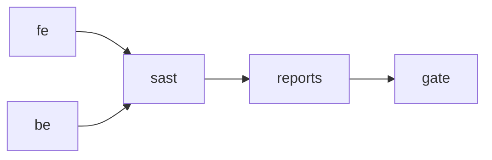

# 🏢 Enterprise GitLab CI - Quality Gates & Security

## 🆕 What's New in Enterprise Version

### **HTML Reports & Artifacts**
- **ESLint Report**: Interactive HTML cu highlighting și statistici
- **Bandit Security Report**: HTML report cu vulnerability details
- **MyPy Type Report**: HTML coverage cu missing types
- **Flake8 Quality Report**: Code quality metrics și hotspots
- **Coverage Report**: Test coverage cu line-by-line analysis
- **Master Dashboard**: Unified HTML dashboard cu toate metrics

### 🛡️ **GitLab SAST Integration** 
- **Built-in SAST**: Automatic security scanning cu GitLab templates
- **Dependency Scanning**: Known vulnerability detection
- **License Scanning**: License compliance checking
- **Security Dashboard**: GitLab UI integration pentru vulnerabilities

### **Enhanced Security Scanning**
- **Safety**: Python package vulnerability database
- **Semgrep**: Advanced static analysis patterns 
- **Multiple formats**: JSON + HTML pentru fiecare tool
- **Comprehensive reporting**: Aggregated security summary

### **Quality Metrics Integration**
- **Test Coverage**: XML + HTML cu GitLab merge request integration
- **Quality Gates**: Enhanced blocking cu detailed metrics
- **Artifact Management**: Smart retention policies (1 week/1 month)

## New Pipeline Stages



### Stage 1: `fe` (Frontend + Reports)
```yaml
 ESLint cu JSON + HTML output
 NPM audit cu detailed JSON report 
 Build artifacts cu size metrics
 Formatted HTML reports pentru browsing
```

### Stage 2: `be` (Backend + Multi-format Reports)
```yaml
 Ruff linting (existing)
 MyPy cu HTML type coverage report
 Bandit cu JSON + HTML security reports
 Flake8 backup linting cu HTML report 
 Coverage cu HTML + XML (GitLab integration)
 pip-audit cu JSON security data
 Aggregated security summary HTML
```

### Stage 3: `sast` (GitLab SAST + Custom Security)
```yaml
 GitLab built-in SAST scanning
 Dependency vulnerability scanning
 License compliance scanning 
 Safety Python vulnerability check
 Semgrep advanced pattern analysis
 Python security summary report
```

### Stage 4: `reports` (Master Dashboard)
```yaml
 Quality dashboard cu toate metrics
 Visual status indicators ()
 Quick links la toate sub-reports
 Pipeline metadata integration
 Professional styled HTML output
```

### Stage 5: `gate` (Enhanced Validation)
```yaml 
 All stages validation
 Quality metrics threshold checking
 Security vulnerability blocking
 Comprehensive status reporting
```

## 📁 Artifacts Generated

### **Frontend Artifacts**
```
frontend-lint-report.html # Interactive ESLint report
frontend-audit-report.html # NPM security audit results
eslint-report.json # Raw ESLint data
npm-audit.json # Raw npm audit data
frontend/build/ # Built application
```

### 🐍 **Backend Artifacts**
```
backend/bandit-report.html # Security scan results 
backend/mypy-report/ # Type checking coverage
backend/flake8-report/ # Code quality metrics
backend/coverage-report/ # Test coverage HTML
backend/security-report.html # Aggregated security summary
backend/bandit-report.json # Raw security data
backend/pip-audit.json # Dependency vulnerabilities 
backend/coverage.xml # GitLab coverage integration
backend/junit.xml # Test results
```

### 🛡️ **Security Artifacts**
```
gl-sast-report.json # GitLab SAST results
safety-report.json # Python vulnerability data
semgrep-report.json # Advanced pattern analysis 
python-security-report.html # Custom security summary
```

### **Master Reports**
```
quality-dashboard.html # Master quality dashboard
 # (1 month retention)
```

## 🎛️ GitLab Project Configuration

### 1. Security Dashboard Integration
```bash
# Navigate to: Project → Security & Compliance → Security Dashboard
 SAST results automatically appear
 Dependency scan results integrated 
 Vulnerability management interface
 Security policy enforcement options
```

### 2. Merge Request Integration 
```bash
# Settings → General → Merge request approvals
 "Pipelines must succeed" (blocks failing MRs)
 Security scan results appear in MR interface
 Coverage reports show diff coverage
 Quality metrics visible in MR
```

### 3. Pages Integration (Optional)
```bash
# Settings → Pages 
# Publish quality dashboard as GitLab Pages
 Public quality metrics dashboard
 Historical trend tracking
 Team quality transparency
```

## 🔧 Local Development Integration

### Enhanced Local Testing:
```bash
# Install additional tools
pip install safety semgrep flake8-html pytest-cov

# Generate same reports locally 
cd backend
bandit -ll -r . -f html -o bandit-report.html
mypy . --html-report mypy-report
flake8 . --format=html --htmldir=flake8-report
pytest --cov=. --cov-report=html:coverage-report
safety check
semgrep --config=auto .
```

### View Reports Locally:
```bash
# Open reports in browser
open backend/bandit-report.html
open backend/mypy-report/index.html 
open backend/flake8-report/index.html
open backend/coverage-report/index.html
```

## Quality Metrics Tracking

### In GitLab UI:
- **Security Dashboard**: Vulnerability trends
- **Merge Requests**: Coverage diff și quality metrics
- **Pipeline**: Artifact browsing și download
- **Issues**: Auto-created pentru security findings

### Custom Dashboards:
- **Quality Dashboard**: Master overview cu status
- **Security Reports**: Detailed vulnerability analysis
- **Coverage Reports**: Test coverage trends
- **Performance**: Build time și artifact size tracking

## Enterprise Benefits

### **Developer Experience**
- **Visual Reports**: HTML în loc de raw text output
- **Comprehensive Coverage**: Multiple tools cu aggregated results 
- **GitLab Integration**: Native UI pentru security și quality
- **Artifact Browsing**: Easy access la historical reports

### 🛡️ **Security & Compliance**
- **Multi-layer Security**: Bandit + Safety + Semgrep + GitLab SAST
- **Vulnerability Management**: GitLab Security Dashboard integration
- **Audit Trail**: Comprehensive artifact retention
- **Compliance Ready**: License scanning și dependency tracking

### **Management & Visibility** 
- **Quality Dashboards**: Executive-ready quality metrics
- **Trend Analysis**: Historical quality tracking
- **Team Transparency**: Public quality metrics (via Pages)
- **ROI Tracking**: Quality improvement measurement

## Upgrade Path

### From Basic GitLab CI:
```bash
# Replace .gitlab-ci.yml with enterprise version
cd /app 
git checkout chore/qa-gates-ci-gitlab-enterprise
cp .gitlab-ci.yml your-project/
git commit -m "upgrade: enterprise GitLab CI with HTML reports & SAST"
```

### From GitHub Actions:
```bash 
# Keep local hooks, switch CI platform
# All quality gates remain identical
# Enhanced reporting available immediately
```

---

## **Ready for Enterprise Deployment!**

**FlowMind Analytics** acum are un sistem complet **enterprise-grade** cu:

 **Visual HTML Reports** pentru toate quality tools 
 **GitLab SAST Integration** cu Security Dashboard 
 **Comprehensive Security Scanning** (4+ tools) 
 **Quality Dashboard** pentru management visibility 
 **Professional Artifacts** cu smart retention 
 **Native GitLab Integration** cu MR și UI 

**Perfect pentru echipe enterprise cu cerințe stricte de compliance și reporting! 🏢**