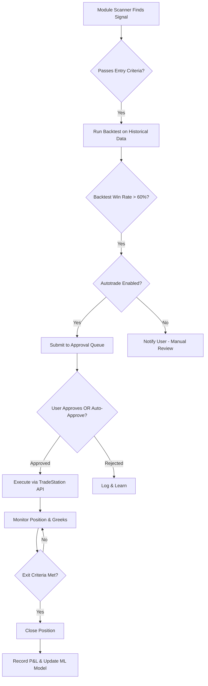

# 🧠 Mindfolio Vision: The World's First AI-Powered Trading Portfolio

## 🎯 What Makes Mindfolio Special?

Mindfolio is **NOT** just another portfolio tracker. It's a **living, learning trading entity** that combines:
- ✅ **Autonomous AI Modules** that scout, analyze, and execute trades
- ✅ **Real-time Intelligence** from options flow, dark pool, and congress trades
- ✅ **Per-Portfolio Personality** - each Mindfolio has its own risk profile and learning curve
- ✅ **Smart Execution** via TradeStation with backtesting and paper trading
- ✅ **FIFO-based P&L** with Greeks aggregation and correlation analysis

---

## 🤖 Core Features: What Mindfolio Can Do

### 1. **Autonomous AI Modules** 🧠
Each Mindfolio can run **multiple AI trading modules** simultaneously, each with:
- **Independent budget allocation** (e.g., $5,000 for IV Service, $3,000 for Sell Puts)
- **Risk limits per trade** (max $500 risk per position)
- **Daily loss limits** (auto-pause if daily loss > $1,000)
- **Auto-trade capability** (with approval workflows)

**Available Modules:**
```python
{
  "IV_SERVICE": {
    "strategies": ["Iron Condor", "Calendar Spread", "Diagonal Spread", "Double Diagonal"],
    "scanning": "Real-time IV rank analysis across 500+ underlyings",
    "entry_criteria": "IV Rank > 50, high liquidity, earnings > 30 days out",
    "exit_criteria": "50% max profit, 21 DTE, or stop loss hit",
    "budget": 5000,
    "autotrade": true
  },
  "SELL_PUTS_ENGINE": {
    "strategies": ["Cash-Secured Puts", "Conversion to Covered Calls"],
    "scanning": "Delta 0.20-0.30 puts with premium > 1% weekly",
    "entry_criteria": "Stocks you want to own, high IV, strong fundamentals",
    "exit_criteria": "Assignment (buy stock) or expire worthless",
    "budget": 10000,
    "autotrade": false
  },
  "SMART_REBALANCER": {
    "function": "AI-driven portfolio rebalancing based on correlation, sector exposure, Greeks",
    "triggers": "Portfolio drift > 5%, high correlation clusters, theta decay imbalance",
    "actions": "Suggest closes, rolls, or hedges",
    "budget": 0,  // Uses existing positions
    "autotrade": false
  },
  "GAMMA_SCALPER": {
    "strategies": ["Delta-neutral straddles/strangles with gamma hedging"],
    "scanning": "High gamma opportunities around earnings/events",
    "entry_criteria": "IV spike > 30%, liquid options, event catalyst",
    "exit_criteria": "Gamma decay, vol crush, or profit target",
    "budget": 3000,
    "autotrade": false
  }
}
```

---

### 2. **Real-time Portfolio Intelligence** 📊

Every Mindfolio provides **live analytics**:

#### **Position Tracking (FIFO-based)**
```python
# Automatic FIFO calculation for tax efficiency
# Example:
# BUY 100 TSLA @ $250
# BUY 50 TSLA @ $260
# SELL 120 TSLA @ $270
# → Realized P&L: (270-250)*100 + (270-260)*20 = $2,200
# → Remaining: 30 shares @ $260 cost basis
```

#### **Greeks Aggregation**
```python
{
  "portfolio_greeks": {
    "delta": 250.5,        # Net directional exposure
    "gamma": 12.3,         # Rate of delta change
    "theta": -45.2,        # Daily time decay ($45.20/day)
    "vega": 125.8,         # IV sensitivity ($125.80 per 1% IV move)
    "net_delta_dollars": 62625  # delta * spot * 100
  },
  "exposure_breakdown": {
    "long_delta": 450.2,
    "short_delta": -199.7,
    "theta_income": 45.2   # Daily income from theta decay
  }
}
```

#### **Risk Analytics**
```python
{
  "risk_metrics": {
    "var_95": 2500,              # 95% Value at Risk (1-day)
    "max_loss_scenario": -8500,  # Worst-case portfolio loss
    "buying_power_used": 35000,
    "buying_power_available": 15000,
    "concentration_risk": {
      "TSLA": 0.28,  # 28% of portfolio in TSLA (HIGH RISK!)
      "AAPL": 0.15,
      "SPY": 0.12
    },
    "correlation_clusters": [
      ["TSLA", "NVDA", "AMD"],  # High tech correlation
      ["XOM", "CVX"]            # Energy sector
    ]
  }
}
```

#### **Performance Analytics**
```python
{
  "performance": {
    "total_return": 12.5,        # % since inception
    "sharpe_ratio": 1.85,
    "max_drawdown": -8.2,
    "win_rate": 0.68,            # 68% of trades profitable
    "avg_win": 450,
    "avg_loss": -280,
    "profit_factor": 2.1,        # avg_win/avg_loss ratio
    "best_month": "2025-09: +$4,250",
    "worst_month": "2025-07: -$1,820"
  }
}
```

---

### 3. **Mindfolio Personality Profiles** 🎨

Each Mindfolio can have a **personality** that defines its behavior:

#### **Conservative "Income Generator"**
```python
{
  "name": "Dividend Defender",
  "personality": "CONSERVATIVE",
  "modules": [
    {"module": "SELL_PUTS_ENGINE", "budget": 15000, "autotrade": false},
    {"module": "COVERED_CALLS", "budget": 10000, "autotrade": true}
  ],
  "rules": {
    "max_risk_per_trade": 2,      # 2% of portfolio
    "daily_loss_limit": 500,
    "min_delta_sold": 0.20,       # Only sell puts/calls at 0.20 delta
    "target_theta": 100,          # $100/day theta income
    "allowed_underlyings": ["SPY", "QQQ", "AAPL", "MSFT"]  # Blue chips only
  },
  "goals": [
    "Generate $2,000/month in premium income",
    "Acquire quality stocks via assignment",
    "Max drawdown < 10%"
  ]
}
```

#### **Aggressive "Volatility Hunter"**
```python
{
  "name": "Iron Butterfly",
  "personality": "AGGRESSIVE",
  "modules": [
    {"module": "IV_SERVICE", "budget": 8000, "autotrade": true},
    {"module": "GAMMA_SCALPER", "budget": 5000, "autotrade": false}
  ],
  "rules": {
    "max_risk_per_trade": 5,      # 5% of portfolio (higher risk)
    "daily_loss_limit": 1000,
    "min_iv_rank": 60,            # Only trade high IV
    "max_dte": 45,                # Short-dated options
    "profit_target": 0.50         # Take profits at 50% max gain
  },
  "goals": [
    "Capture 15% annual returns from IV crush",
    "Win rate > 65%",
    "Average 30 trades/month"
  ]
}
```

#### **Balanced "All-Weather"**
```python
{
  "name": "Market Maestro",
  "personality": "BALANCED",
  "modules": [
    {"module": "IV_SERVICE", "budget": 5000, "autotrade": true},
    {"module": "SELL_PUTS_ENGINE", "budget": 5000, "autotrade": false},
    {"module": "SMART_REBALANCER", "budget": 0, "autotrade": false}
  ],
  "rules": {
    "max_risk_per_trade": 3,      # 3% of portfolio
    "daily_loss_limit": 750,
    "portfolio_delta_target": [-100, 100],  # Keep delta neutral
    "rebalance_trigger": 0.05,    # Rebalance if drift > 5%
  },
  "goals": [
    "Consistent monthly returns regardless of market direction",
    "Max Sharpe ratio",
    "Low correlation to SPY"
  ]
}
```

---

### 4. **Smart Execution Engine** ⚡

Mindfolio doesn't just suggest trades - it can **execute them** via TradeStation:

#### **Execution Workflow**


#### **Paper Trading Mode**
```python
{
  "paper_trading": {
    "enabled": true,
    "virtual_cash": 50000,
    "simulated_fills": "Real market data with realistic slippage",
    "purpose": "Test module performance before going live",
    "metrics": "Track paper portfolio vs. live portfolio"
  }
}
```

#### **Risk Guardrails**
```python
{
  "guardrails": {
    "pre_trade_checks": [
      "Sufficient buying power?",
      "Within daily loss limit?",
      "Position concentration < 20%?",
      "Portfolio delta within range?",
      "Backtested win rate > threshold?"
    ],
    "post_trade_monitoring": [
      "Stop loss monitoring (real-time)",
      "Profit target alerts",
      "Greeks drift notifications",
      "Earnings date proximity warnings"
    ],
    "emergency_stop": {
      "trigger": "Daily loss > 2x limit OR portfolio drawdown > 15%",
      "action": "Pause all autotrade, notify user, suggest hedges"
    }
  }
}
```

---

### 5. **Learning & Optimization** 🧠

Mindfolio **learns from every trade** and gets smarter over time:

#### **Machine Learning Features**
```python
{
  "learning_engine": {
    "data_collection": [
      "Entry IV rank, DTE, delta, theta",
      "Exit P&L, days held, exit reason",
      "Market conditions (VIX, sector performance)",
      "News sentiment at entry/exit"
    ],
    "optimization_targets": [
      "Strike selection (which deltas win most?)",
      "DTE selection (30 vs 45 vs 60 days)",
      "Profit taking (25% vs 50% vs 75%)",
      "Stop loss levels (1x credit vs 2x credit)",
      "Entry timing (time of day, day of week)"
    ],
    "ml_models": {
      "win_probability": "Predict trade success based on entry conditions",
      "optimal_exit": "Suggest best exit timing",
      "strike_selection": "Recommend optimal strikes for strategy",
      "portfolio_allocation": "Optimize module budgets based on performance"
    }
  }
}
```

#### **Continuous Improvement**
```python
{
  "feedback_loop": {
    "weekly_review": "Analyze last 7 days of trades, identify patterns",
    "monthly_optimization": "Adjust module parameters based on 30-day performance",
    "quarterly_rebalance": "Shift budgets from underperforming to winning modules",
    "annual_strategy_review": "Retire poor strategies, add new ones"
  },
  "insights_generated": [
    "IV Service performs best when IV Rank > 70 (not just > 50)",
    "Sell Puts on tech stocks have 12% higher win rate than energy",
    "Calendar spreads in SPY outperform individual stocks by 8%",
    "Exiting at 40% profit (vs 50%) increases total returns by 15%"
  ]
}
```

---

## 🌟 Unique Value Propositions

### **Why Mindfolio vs. Traditional Portfolio Trackers?**

| Feature | Traditional Tracker | **Mindfolio** |
|---------|---------------------|---------------|
| Position tracking | ✅ Manual entry | ✅ **Auto-sync via TradeStation** |
| P&L calculation | ✅ Basic | ✅ **FIFO-based with tax lots** |
| Greeks | ❌ None | ✅ **Real-time aggregation** |
| Risk analytics | ❌ Basic | ✅ **VaR, correlation, concentration** |
| Trade ideas | ❌ None | ✅ **AI-powered module scanners** |
| Execution | ❌ Manual | ✅ **Auto-trade via TradeStation** |
| Learning | ❌ None | ✅ **ML optimization from outcomes** |
| Backtesting | ❌ None | ✅ **Pre-trade backtesting** |
| Module system | ❌ None | ✅ **Autonomous AI modules** |
| Personality | ❌ One-size-fits-all | ✅ **Custom per-portfolio** |

---

## 🚀 Roadmap: Making Mindfolio Reality

### **Phase 1: Foundation** (Current)
- ✅ CRUD operations (create, list, view, edit Mindfolios)
- ✅ Module allocation system
- ✅ Transaction & position tracking (FIFO)
- ✅ Dashboard overview

### **Phase 2: Intelligence** (Next 2-4 weeks)
- [ ] Real-time Greeks calculation
- [ ] Risk analytics (VaR, concentration, correlation)
- [ ] Performance metrics (Sharpe, win rate, profit factor)
- [ ] Investment Scoring integration (stock scanner)

### **Phase 3: AI Modules** (4-8 weeks)
- [ ] IV Service scanner (Iron Condor, Calendar, Diagonal)
- [ ] Sell Puts Engine (CSP scanner with fundamentals)
- [ ] Smart Rebalancer (correlation & sector analysis)
- [ ] Module backtesting framework

### **Phase 4: Execution** (8-12 weeks)
- [ ] TradeStation OAuth setup
- [ ] Paper trading mode
- [ ] Auto-trade with approval workflows
- [ ] Stop loss & profit target monitoring

### **Phase 5: Learning** (12-16 weeks)
- [ ] Trade outcome database
- [ ] ML model training (win probability, optimal exit)
- [ ] Parameter optimization (strike selection, DTE)
- [ ] Quarterly strategy reviews

---

## 💡 Example Use Cases

### **Use Case 1: "Retirement Income" Mindfolio**
```python
{
  "goal": "Generate $3,000/month in safe income",
  "modules": [
    {"SELL_PUTS_ENGINE": "Sell 0.20 delta puts on SPY/QQQ/AAPL"},
    {"COVERED_CALLS": "Sell calls against assigned stock"}
  ],
  "strategy": "Collect premium, own quality stocks via assignment",
  "expected_return": "12-15% annually with low volatility"
}
```

### **Use Case 2: "Volatility Arbitrage" Mindfolio**
```python
{
  "goal": "Profit from IV crush after earnings",
  "modules": [
    {"IV_SERVICE": "Iron Condors on IV Rank > 70"},
    {"GAMMA_SCALPER": "Earnings straddles with gamma hedging"}
  ],
  "strategy": "Sell high IV, buy it back cheap after vol crush",
  "expected_return": "25-35% annually with moderate risk"
}
```

### **Use Case 3: "Diversified All-Weather" Mindfolio**
```python
{
  "goal": "Consistent returns in any market condition",
  "modules": [
    {"IV_SERVICE": 40% budget},
    {"SELL_PUTS_ENGINE": 40% budget},
    {"SMART_REBALANCER": 20% active management}
  ],
  "strategy": "Mix of theta decay + premium selling + smart rebalancing",
  "expected_return": "18-22% annually with balanced risk"
}
```

---

## 🎯 Bottom Line

**Mindfolio is NOT a portfolio tracker.**

It's a **24/7 AI trading assistant** that:
1. **Scouts** the market for high-probability setups
2. **Analyzes** Greeks, risk, and backtest performance
3. **Executes** trades (with your approval)
4. **Monitors** positions and manages exits
5. **Learns** from outcomes to get better over time

All while you sleep, work, or enjoy life. 🌴

---

**Domain Ready:** Mindfolio.com 🚀  
**Tagline:** *"Your Portfolio, Powered by AI"*  
**Target Launch:** Q1 2026

---

*Built with ❤️ on FlowMind Platform*
